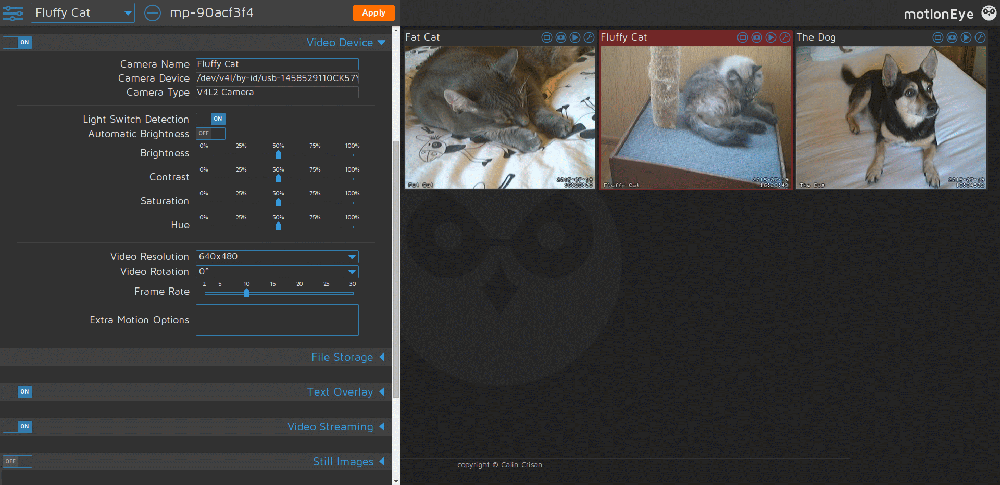

<!--
N.B.: This README was automatically generated by https://github.com/YunoHost/apps/tree/master/tools/README-generator
It shall NOT be edited by hand.
-->

# motionEye for YunoHost

[](https://dash.yunohost.org/appci/app/motioneye)  

[](https://install-app.yunohost.org/?app=motioneye)

*[Lire ce readme en français.](./README_fr.md)*

> *This package allows you to install motionEye quickly and simply on a YunoHost server.
If you don't have YunoHost, please consult [the guide](https://yunohost.org/#/install) to learn how to install it.*

## Overview

This is a dummy description of this app features


**Shipped version:** 0.2023.07.31

## Screenshots



## Documentation and resources

* Official app website: <https://github.com/motioneye-project/motioneye>
* Official user documentation: <https://github.com/motioneye-project/motioneye/wiki>
* Upstream app code repository: <https://github.com/motioneye-project/motioneye>
* YunoHost documentation for this app: <https://yunohost.org/app_motioneye>
* Report a bug: <https://github.com/YunoHost-Apps/motioneye_ynh/issues>

## Developer info

Please send your pull request to the [testing branch](https://github.com/YunoHost-Apps/motioneye_ynh/tree/testing).

To try the testing branch, please proceed like that.

``` bash
sudo yunohost app install https://github.com/YunoHost-Apps/motioneye_ynh/tree/testing --debug
or
sudo yunohost app upgrade motioneye -u https://github.com/YunoHost-Apps/motioneye_ynh/tree/testing --debug
```

**More info regarding app packaging:** <https://yunohost.org/packaging_apps>
